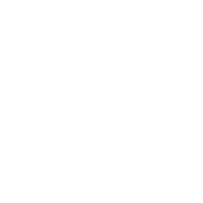

<div align="center">



# Obscura

[](https://github.com/jeremiejt38/Obscura/releases)
[](https://github.com/jeremiejt38/Obscura)
[](https://www.python.org/)
[](LICENSE)

**Offline, cross-platform screenshot redaction for sensitive text.**

> **v0.2.0 is a test release.** Linux receives manual validation; Windows and macOS binaries are technical previews until they receive manual platform validation.

</div>

## Introduction

Obscura runs Tesseract OCR locally, detects common sensitive values with regular expressions, redacts matching regions, and can replace an image directly in the clipboard. No image content is sent to a network service.

## Table of contents

- [Features](#features)
- [Prerequisites](#prerequisites)
- [Supported environments](#supported-environments)
- [Installation](#installation)
- [Quick start](#quick-start)
- [Usage](#usage)
- [Privacy and detection](#privacy-and-detection)
- [Updates](#updates)
- [Changelog](#changelog)
- [Development and tests](#development-and-tests)
- [Release readiness plan](docs/RELEASE_READINESS_PLAN.md)
- [Roadmap to v1.0.0](#roadmap-to-v100)
- [Post-v1 roadmap](#post-v1-roadmap)
- [Contributing](#contributing)
- [License](#license)

## Features

- Local OCR powered by Tesseract.
- Detection for emails, IP addresses, JWTs, API keys, IBANs, phone numbers, card numbers, password assignments, and private-key headers.
- Black-box, Gaussian-blur, and pixelation redaction modes.
- Configurable categories, custom keywords, OCR confidence, and French/English OCR.
- A PySide6 system-tray application that monitors the clipboard by default and can monitor a screenshot folder recursively.
- Linux, Windows, and macOS clipboard backends.

## Prerequisites

- Python 3.9 or newer.
- Tesseract OCR installed on the operating system.
- An image clipboard backend for the platform.

## Supported environments

| Environment | Support | Notes |
| --- | --- | --- |
| Linux | Yes | X11 with `xclip` or Wayland with `wl-clipboard` |
| macOS | Yes | Native Cocoa clipboard binding |
| Windows | Yes | Native Windows clipboard binding |

### Linux

Install Tesseract and one clipboard backend:

```bash
sudo apt update
sudo apt install tesseract-ocr xclip
```

For Wayland, install `wl-clipboard` instead of or alongside `xclip`:

```bash
sudo apt install tesseract-ocr wl-clipboard
```

### macOS

```bash
brew install tesseract
```

The Python installation installs the native Cocoa clipboard binding automatically. Test-release binaries are unsigned and may be blocked or warned about by Gatekeeper.

### Windows

Install Tesseract with its installer and ensure its installation directory is on `PATH`. The Python installation installs the Windows clipboard binding automatically. Test-release binaries are unsigned and may receive a SmartScreen warning.

## Installation

Install directly from a local checkout:

```bash
python -m venv .venv
```

Linux and macOS:

```bash
source .venv/bin/activate
python -m pip install --upgrade pip
python -m pip install .
```

Windows PowerShell:

```powershell
.venv\Scripts\Activate.ps1
python -m pip install --upgrade pip
python -m pip install .
```

The `obscura` command and the `obscura-desktop` system-tray application are then available in the active environment.

## Quick start

```bash
obscura-desktop
```

Obscura starts in the system tray and watches clipboard images by default. Open **Settings** from the tray menu to choose detection categories, redaction style, languages, notifications and an optional screenshot folder.

## Usage

### Process one image

```bash
obscura /path/to/screenshot.png
```

The output is written next to the source as `screenshot-obscura.png`.

### Copy a processed image to the clipboard

```bash
obscura /path/to/screenshot.png --copy
```

### Use Gaussian blur

```bash
obscura /path/to/screenshot.png --blur
```

### Start the desktop tray application

```bash
obscura-desktop
```

The tray application watches clipboard images by default. Its context menu lets you toggle clipboard and directory monitoring, enable launch at startup, open settings, check for updates, and quit. Settings are stored locally in the operating system application-data directory.

### Watch the image clipboard

```bash
obscura
```

Every new clipboard image is scanned and replaced only when a sensitive region is found. Stop the watcher with `Ctrl+C`.

### Watch a screenshot folder

```bash
obscura ~/Pictures/Screenshots --watch-dir --copy
```

Generated files whose stem ends in `-obscura` are ignored, preventing the watcher from reprocessing its own output. The desktop application keeps originals by default and writes results to the configured output directory; source replacement requires an explicit setting.

## Privacy and detection

Patterns live in `obscura.redactor.SENSITIVE_PATTERNS`. OCR can make mistakes, so review redacted output before sharing it. Clipboard mode replaces only the current clipboard image. Folder monitoring preserves originals by default; source replacement is an explicit desktop setting. Face and name detection are reserved for optional local models and are disabled until such models are installed.

## Updates

Obscura never checks for updates automatically. Select **Check for updates** from Settings when you want to contact GitHub. This request retrieves release metadata only; image content, OCR text, and local configuration are never sent. If an update is available, installation starts only after you select it, and the downloaded binary is verified with its SHA-256 checksum before replacement.

## Test-release binaries

GitHub Releases publish raw PyInstaller binaries named `obscura-linux`, `obscura-windows.exe`, and `obscura-macos`, each with a matching `.sha256` file. Verify the checksum before running a downloaded binary. These binaries do not bundle Tesseract or an OS-native installer.

## Changelog

See [CHANGELOG.md](CHANGELOG.md) and [GitHub Releases](https://github.com/jeremiejt38/Obscura/releases) for the detailed version history.

## Development and tests

```bash
python -m pip install . pytest
python -m pytest
```

See [docs/TESTING.md](docs/TESTING.md) for validation rules and test guidance.

GitHub Actions run tests on Linux, Windows and macOS. Release Please creates a release pull request from Conventional Commits on `main`; merging that reviewed pull request updates the version and changelog, creates the annotated `vX.Y.Z` tag, and triggers the binary build workflow. Do not create release tags manually.

See [the project workflow](docs/PROJECT_WORKFLOW.md) for branch lifecycle, release policy and the optional alpha/beta channels.

## Roadmap to v1.0.0

- [ ] Stabilize the system-tray workflow across supported desktop environments.
- [ ] Expand automated coverage for OCR, clipboard and directory monitoring behavior.
- [ ] Validate packaged releases and update recovery on Linux, macOS and Windows.
- [ ] Publish the first stable desktop release after privacy and usability validation.

## Post-v1 roadmap

- **Optional local face and name models** — enable additional local-only redaction methods without uploading image data.
- **Detection and workflow refinement** — improve configurable patterns, accessibility and desktop workflow ergonomics.

## Contributing

Contributions and bug reports are welcome. Read [CONTRIBUTING.md](CONTRIBUTING.md), use short-lived branches, keep commits atomic, follow [Conventional Commits](https://www.conventionalcommits.org/), and follow [the project workflow](docs/PROJECT_WORKFLOW.md).

For security vulnerabilities, do not open a public issue; read [SECURITY.md](SECURITY.md).

## License

[MIT](LICENSE)
